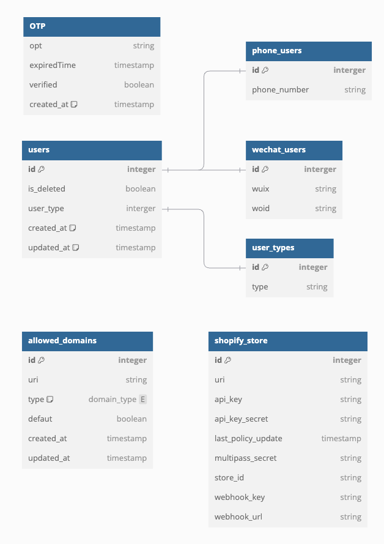
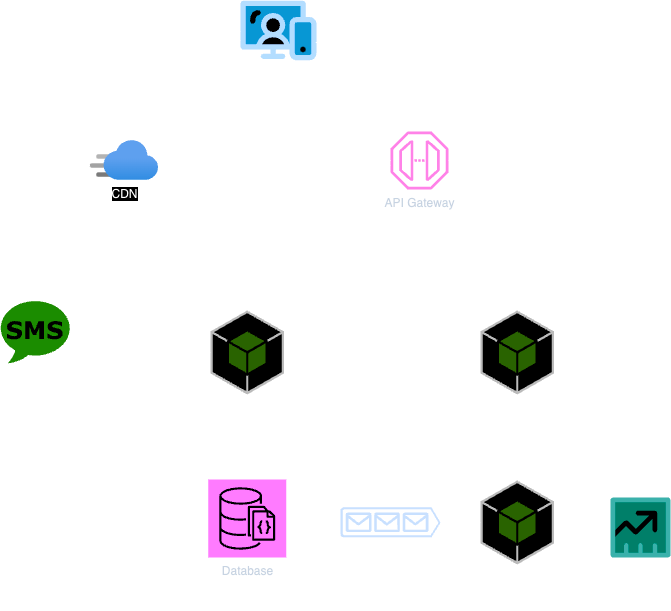

# Authentication Service

## Overview

The Authentication Service is a microservice that handles user authentication and authorization. It is responsible for creating, updating, and deleting user accounts, as well as generating and verifying tokens for secure communication between services.

## Requirements

### Functional requirements

1. Alowing the user to sign up, sign in, and sign out.
2. Signup method:
   - Phone number (OTP)
   - WeChat QR code
3. After login, the user will be redirected to the site or application base on the callbackUrl parameter.
4. Session management: Efficiently manage user sessions to ensure security.
5. Synchronize user information with 3rd party service (e.g. Salesforce).
6. Expose a RESTful API for other services to use (e.g. mobile application).
7. Audit Trail : Maintain detailed logs of authentication events for auditing.

### Non-functional requirements

1. Security : Prioritize data security through encryption, secure storage, and secure communication.
2. Scalability : Design the system to handle a growing number of users and transactions.
3. Reliability : Minimize system downtime and ensure high availability.
4. Usability : Develop an intuitive user interface for a seamless experience.

## Back-of-the-envelope estimation

### Assumptions

- 10% of users will sign up via phone number
- 90% of users will sign up via WeChat QR code
- 1000 QPS for sign in and sign up per day
- 10000 visits per day

### Estimation

1. Storage

2. Bandwidth
   - 10000 visits per day * 300 bytes per visit / 1024 / 1024 ~= 30GB per day
   - 1000 QPS * 300 bytes per request / 1024 / 1024 ~= 300GB per day

## System Interface

### API Interface

<details>
<summary>1. Get OTP with phone number</summary>

- **Endpoint:** `/api/v1/get_otp`
- **Method:** `GET`
- **Description:** Get OTP with phone number.
- **Path Parameter:**
- `phone_number`: The phone number.
- **Response:**

   ```json
   {
      "key": "secret_key"
   }
   ```

</details>

<details>
<summary>2. Login with phone number and OTP</summary>

- **Endpoint:** `/api/v1/login_phone`
- **Method:** `POST`
- **Description:** Login with phone number and OTP.
- **Request Body:**

   ```json
   {
      "phone_number": "1234567890",
      "otp": "123456",
      "key": "secret_key"
   }
   ```

- **Response:**
   Set session via cookie.

   ```json
   {
      "success": true
   }
   ```

</details>

<details>
<summary>3. Login with WeChat QR code</summary>

- **Endpoint:** `/api/v1/login_wechat`
- **Method:** `POST`
- **Description:** Login with WeChat QR code.
- **Request Body:**

   ```json
   {
      "code": "code_from_wechat"
   }
   ```

- **Response:**
   Set session via cookie.

   ```json
   {
      "success": true
   }
   ```

</details>

<details>
<summary>4. Get Redirect URL</summary>

- **Endpoint:** `/api/v1/redirect_url`
- **Method:** `GET`
- **Header:** Auth session from cookie
- **Description:** Get Redirect URL.
- **Path Parameter:**

   ```json
   {
      "callback_url": "callback_url"
   }
   ```

- **Response:**

   ```json
   {
      "redirect_url": "redirect_url"
   }
   ```

</details>

<details>
<summary>5. Get User Info</summary>

- **Endpoint:** `/api/v1/user`
- **Method:** `GET`
- **Description:** Get Redirect URL.
- **Path Parameter:**

   ```json
   {
      "token": "token"
   }
   ```

- **Response:**

   ```json
   {
      "phone_number": "1234567890",
      "wuid": "wuid"
   }
   ```

</details>

### Database Design



Figure 1: Database Design

## High Level Design



Figure 2: High Level Design
